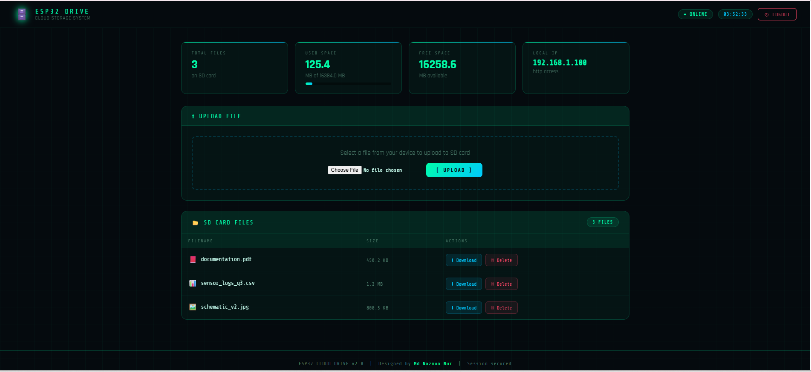

<div align="center">

# 🗄️ ESP32 Unified Cloud Drive
### Version 2.0 Pro

**A standalone, secure, local cloud storage system built on the ESP32 microcontroller.**  
Access and manage files on an SD card through a stunning web dashboard on your local network, or remotely from anywhere in the world via a Telegram Bot.

[](https://www.arduino.cc/)
[](https://www.espressif.com/en/products/socs/esp32)
[](LICENSE)
[](#)
[](https://github.com/n00rtahsin)

---



</div>

---

## 📖 Table of Contents

- [Overview](#-overview)
- [Features](#-features)
- [System Architecture](#-system-architecture)
- [Hardware Requirements](#-hardware-requirements)
- [Wiring Guide](#-wiring-guide)
- [Software Dependencies](#-software-dependencies)
- [Setup & Installation](#-setup--installation)
  - [1. Prepare the Arduino IDE](#1-prepare-the-arduino-ide)
  - [2. Install Required Libraries](#2-install-required-libraries)
  - [3. Create a Telegram Bot](#3-create-a-telegram-bot)
  - [4. Find Your Telegram Chat ID](#4-find-your-telegram-chat-id)
  - [5. Configure the Firmware](#5-configure-the-firmware)
  - [6. Prepare the SD Card](#6-prepare-the-sd-card)
  - [7. Flash the Firmware](#7-flash-the-firmware)
- [Usage Guide](#-usage-guide)
  - [Web Dashboard](#web-dashboard-local-network)
  - [Telegram Bot Commands](#telegram-bot-remote-access)
  - [OLED Status Display](#oled-status-display)
- [Security Architecture](#-security-architecture)
- [Web Server Routes](#-web-server-routes)
- [Firmware Code Structure](#-firmware-code-structure)
- [Project File Structure](#-project-file-structure)
- [Troubleshooting](#-troubleshooting)
- [Known Limitations](#-known-limitations)
- [Future Roadmap](#-future-roadmap)
- [Contributing](#-contributing)
- [License](#-license)
- [Author](#-author)

---

## 🔭 Overview

**ESP32 Unified Cloud Drive** transforms a low-cost ESP32 microcontroller into a fully functional, self-hosted file server with a production-quality web interface and remote Telegram access. Unlike cloud services that rely on third-party infrastructure, this project gives you complete control over your data — it runs entirely on your local network with no subscription, no external server, and no data ever leaving your own hardware.

The system serves two complementary access modes:

**Local Mode (Web UI):** Any device on the same WiFi network can open a browser, navigate to the ESP32's IP address, log in with a password, and immediately upload, download, or delete files stored on the attached MicroSD card.

**Remote Mode (Telegram Bot):** From anywhere in the world with an internet connection, the designated admin can send commands to a private Telegram Bot to list files, receive download links, delete files, check storage, get the device's IP address, and even reboot the ESP32 remotely.

The firmware is written in C++ for the Arduino framework and is contained in a single, well-structured `.ino` file of approximately 1,100 lines, organized into clearly labeled sections for easy modification.

---

## ✨ Features

### 🌐 Web Dashboard

| Feature | Description |
|---|---|
| **Password-Protected Login** | A dedicated login portal with username/password authentication before any files can be accessed. |
| **Session Token Management** | Login issues a pseudo-random session token derived from the ESP32's unique chip ID and uptime. Sessions automatically expire after 30 minutes of inactivity. |
| **Glassmorphism Dark UI** | A responsive, animated dark-themed interface with glassmorphism card effects, a moving grid background, glowing orb accents, and corner-bracket decorations. |
| **File Upload** | Upload any file type from your browser directly to the MicroSD card using multipart form upload. |
| **File Download** | Download any file from the SD card to your device with a single click, served as `application/octet-stream`. |
| **File Deletion** | Delete individual files from the SD card with a confirmation prompt to prevent accidental removal. |
| **File Type Icons** | Files are automatically classified and shown with context-aware icons for images, audio, video, PDFs, archives, text files, and data files. |
| **Real-Time Storage Analytics** | Stat cards display the total SD card capacity, used space, free space (all in MB), current file count, and local IP address. A visual gradient progress bar shows the used-space percentage. |
| **Live Clock** | A real-time clock is displayed in the header navigation bar, updated every second via JavaScript. |
| **Flash Notifications** | Upload success, upload failure, delete success, and delete failure are communicated via styled alert banners after each operation. |
| **Logout** | A dedicated logout button invalidates the session token and clears the session cookie immediately. |
| **Responsive Layout** | The interface adapts for both desktop and mobile screens. |

### 🤖 Telegram Bot

| Command | Description |
|---|---|
| `/start` | Displays a welcome message to the authorised user along with the full command list and the current local web UI URL. |
| `/help` | Shows a brief pointer back to `/start` for the command list. |
| `/list` | Lists all files currently stored in the root of the SD card, showing each filename and its size in KB or MB. |
| `/stats` | Provides a formatted breakdown of SD card storage with Total, Used, and Free space in MB, a file count, and a text-based visual progress bar showing used percentage. |
| `/send <filename>` | Generates and returns a direct HTTP download link for the specified file on the local web server. The user must be on the same WiFi network to use the link. |
| `/delete <filename>` | Permanently deletes the specified file from the SD card and confirms the operation. |
| `/ip` | Replies with the ESP32's current local IP address and the full web UI URL. Useful after a DHCP lease renewal. |
| `/reboot` | Sends a confirmation message and then immediately triggers `ESP.restart()` to reboot the device remotely. |

### 📟 OLED Status Display

| Feature | Description |
|---|---|
| **Boot Animation** | A progressive loading bar animation plays on boot, displaying the firmware version and boot status. |
| **WiFi Connection** | The display shows connection progress and the assigned local IP address on startup. |
| **Live Process Updates** | Key events (login success, failed login, file upload in progress, upload done, file deletion, Telegram messages) are reflected on the OLED in real time. |
| **Always-On Header Bar** | A persistent white status bar reading "ESP32 CLOUD DRIVE" runs across the top of every OLED screen. |

### 🔒 Security

| Feature | Description |
|---|---|
| **Credential Authentication** | Web access requires a username and password that are hardcoded in the configuration section. |
| **Session Expiry** | Sessions automatically expire after 30 minutes; all protected routes re-check the session on every request. |
| **Chat ID Locking** | The Telegram Bot will only respond to commands from the one Telegram Chat ID configured at compile time. |
| **Intrusion Alerts** | Any message from an unknown Telegram Chat ID is rejected, logged to Serial, and an instant security alert containing the attacker's Chat ID is forwarded to the admin. |
| **HttpOnly Cookie** | The session cookie is flagged `HttpOnly` to prevent JavaScript-based cookie theft. |

---

## 🏗️ System Architecture

```
┌─────────────────────────────────────────────────────────────┐
│                        ESP32 (Firmware)                      │
│                                                             │
│  ┌──────────────┐     ┌───────────────┐     ┌───────────┐  │
│  │  WebServer   │     │ Telegram Bot  │     │   OLED    │  │
│  │  (Port 80)   │     │  (Poll Loop)  │     │  Display  │  │
│  └──────┬───────┘     └──────┬────────┘     └───────────┘  │
│         │                   │                               │
│  ┌──────▼───────────────────▼────────┐                     │
│  │         SD Card (FAT32 via SPI)   │                     │
│  └───────────────────────────────────┘                     │
│                      │                                      │
│              ┌───────▼──────┐                               │
│              │  WiFi Stack  │                               │
│              └───────┬──────┘                               │
└──────────────────────┼──────────────────────────────────────┘
                       │
          ┌────────────┴──────────────┐
          │                           │
   Local Network                 Internet
   (192.168.x.x)           (api.telegram.org)
          │                           │
   ┌──────▼──────┐           ┌────────▼──────┐
   │  Browser /  │           │  Telegram App │
   │  Web Client │           │  (any device) │
   └─────────────┘           └───────────────┘
```

**Data Flow (Web Upload):**
`Browser → POST /upload (multipart) → ESP32 WebServer → SD.open(FILE_WRITE) → SD Card`

**Data Flow (Web Download):**
`Browser → GET /download?f=name → ESP32 WebServer → SD.open(FILE_READ) → server.streamFile() → Browser`

**Data Flow (Telegram /send):**
`Telegram → Bot API → ESP32 (poll) → SD.exists() → Reply with local HTTP link → User opens link in browser`

---

## 🛠️ Hardware Requirements

| Component | Specification | Notes |
|---|---|---|
| **ESP32 Development Board** | NodeMCU-32S, WROOM-32, DEVKIT V1, or equivalent | Any standard ESP32 board with WiFi will work. |
| **MicroSD Card Adapter Module** | SPI interface, 3.3V or 5V compatible | Common modules include the GY-21 style 6-pin SPI breakout. |
| **MicroSD Card** | Any capacity, formatted as **FAT32** | Cards up to 32 GB are reliably supported with the Arduino `SD.h` library. |
| **OLED Display** | 0.96" SSD1306, **I2C interface**, 128×64 pixels | Must use I2C variant (2-wire: SDA + SCL), not SPI variant. Default I2C address `0x3C`. |
| **Jumper Wires** | Male-to-male or male-to-female as required | — |
| **Breadboard** | Optional, for prototyping | — |
| **USB Cable** | Micro-USB or USB-C depending on your board | For programming and power during testing. |

> **Power Note:** The ESP32 itself typically draws 80–240 mA depending on WiFi activity. The OLED adds ~20 mA. Ensure your USB power source or external supply can provide at least 500 mA.

---

## 🔌 Wiring Guide

### SD Card Module → ESP32

| SD Card Module Pin | ESP32 GPIO Pin | Signal |
|---|---|---|
| CS (Chip Select) | **GPIO 5** | SPI Chip Select |
| MOSI | **GPIO 23** | SPI Master Out Slave In |
| MISO | **GPIO 19** | SPI Master In Slave Out |
| SCK (Clock) | **GPIO 18** | SPI Clock |
| VCC | 3.3V or 5V | Power (check your module's regulator) |
| GND | GND | Ground |

### OLED Display (SSD1306 I2C) → ESP32

| OLED Pin | ESP32 GPIO Pin | Signal |
|---|---|---|
| SDA | **GPIO 21** | I2C Data |
| SCL | **GPIO 22** | I2C Clock |
| VCC | 3.3V | Power |
| GND | GND | Ground |

> **I2C Note:** GPIO 21 and 22 are the default hardware I2C pins on ESP32 (`Wire.begin()` uses them automatically — no explicit `Wire.begin(21, 22)` call is needed).

### Complete Pinout Summary

```
ESP32                SD Module          OLED (I2C)
-----                ---------          ----------
GPIO 5  ──────────── CS
GPIO 23 ──────────── MOSI
GPIO 19 ──────────── MISO
GPIO 18 ──────────── SCK
GPIO 21 ────────────────────────────── SDA
GPIO 22 ────────────────────────────── SCL
3.3V    ──────────── VCC ────────────── VCC
GND     ──────────── GND ────────────── GND
```

---

## 📦 Software Dependencies

### Arduino IDE Board Package

You must have the **ESP32 board package** installed. In Arduino IDE:

1. Go to **File → Preferences**.
2. In "Additional Board Manager URLs", add:  
   `https://raw.githubusercontent.com/espressif/arduino-esp32/gh-pages/package_esp32_index.json`
3. Go to **Tools → Board → Boards Manager**, search for `esp32`, and install the package by **Espressif Systems**.

### External Libraries (install via Library Manager)

| Library | Author | Purpose |
|---|---|---|
| **Adafruit GFX Library** | Adafruit | Core graphics primitives for the OLED. |
| **Adafruit SSD1306** | Adafruit | Driver for the SSD1306 OLED display. |
| **UniversalTelegramBot** | Brian Lough | Polling-based Telegram Bot API client for ESP32. |
| **ArduinoJson** | Benoit Blanchon | JSON parsing required by UniversalTelegramBot to decode API responses. |

To install each library: Go to **Sketch → Include Library → Manage Libraries…**, search by name, and click **Install**.

### Built-in Libraries (included with ESP32 board package — no installation needed)

| Library | Purpose |
|---|---|
| `WiFi.h` | WiFi station mode, connection management. |
| `WiFiClientSecure.h` | TLS/SSL client for secure HTTPS connections to Telegram's API. |
| `WebServer.h` | HTTP/1.1 web server with route handler registration. |
| `SPI.h` | SPI bus communication with the SD card module. |
| `SD.h` | FAT32 SD card file system access (read, write, delete, stat). |
| `Wire.h` | I2C bus communication for the OLED display. |
| `mbedtls/md.h` | Hardware-accelerated hash functions used in session token generation. |

---

## 🚀 Setup & Installation

### 1. Prepare the Arduino IDE

Download and install the **Arduino IDE 2.x** from [https://www.arduino.cc/en/software](https://www.arduino.cc/en/software). Follow the board package installation steps described in [Software Dependencies](#-software-dependencies) above.

### 2. Install Required Libraries

Open Arduino IDE and navigate to **Sketch → Include Library → Manage Libraries…**. Install each of the four external libraries listed in the table above, making sure you get the correct author's version:

- `Adafruit GFX Library` by **Adafruit**
- `Adafruit SSD1306` by **Adafruit**
- `UniversalTelegramBot` by **Brian Lough**
- `ArduinoJson` by **Benoit Blanchon** (version 6.x recommended)

### 3. Create a Telegram Bot

1. Open the Telegram app on your phone or computer.
2. Search for the user **@BotFather** and open a chat.
3. Send the command `/newbot`.
4. BotFather will ask you to choose a **name** for your bot (e.g., "My ESP32 Drive"). Type it and press Enter.
5. BotFather will then ask for a **username** — it must end in `bot` (e.g., `MyESP32DriveBot`). Type it and press Enter.
6. BotFather will reply with your bot's **HTTP API Token** — a long string that looks like:  
   `1234567890:ABCDEFGHIJKLMNOPQRSTUVWXYZabcdefghi`
7. **Copy and save this token securely.** You will paste it into the firmware configuration.

> **Security Tip:** Never share your Bot Token publicly. Anyone with this token can control your bot.

### 4. Find Your Telegram Chat ID

1. In Telegram, search for the user **@userinfobot** (or **@IDBot**).
2. Start a chat and send `/getid` (or just send any message to @userinfobot).
3. The bot will reply with your personal **Chat ID** — a numeric string like `987654321`.
4. **Copy and save this number.** You will paste it into the firmware configuration.

> **Why is this important?** The Chat ID is used as a hardware security lock — the firmware will only respond to Telegram messages from this exact ID. All other users are blocked and reported.

### 5. Configure the Firmware

Open `ESP32_CloudDrive_v1.ino` in Arduino IDE. Navigate to **SECTION 1 — CONFIGURATION** near the top of the file and fill in your personal details:

```cpp
// ═══════════════════════════════════════════════════════════
// SECTION 1 ── CONFIGURATION (Edit these values)
// ═══════════════════════════════════════════════════════════

// Network
const char* WIFI_SSID     = "YOUR_WIFI_NETWORK_NAME";
const char* WIFI_PASSWORD = "YOUR_WIFI_PASSWORD";

// Telegram
const char* BOT_TOKEN = "1234567890:ABCDEFGHIJKLMNOPQRSTUVWXYZabcdefghi";
const char* CHAT_ID   = "987654321";

// Web Dashboard Credentials
const char* WEB_USERNAME = "admin";
const char* WEB_PASSWORD = "your_secure_password";  // ← Change this!
```

**Configuration Parameter Reference:**

| Parameter | Description | Example |
|---|---|---|
| `WIFI_SSID` | The name (SSID) of your 2.4 GHz WiFi network. | `"HomeNetwork"` |
| `WIFI_PASSWORD` | The password of your WiFi network. | `"mypassword123"` |
| `BOT_TOKEN` | The full API token from BotFather (Step 3). | `"1234567890:ABCDef..."` |
| `CHAT_ID` | Your personal Telegram numeric Chat ID (Step 4). | `"987654321"` |
| `WEB_USERNAME` | Username for the web dashboard login page. | `"admin"` |
| `WEB_PASSWORD` | Password for the web dashboard login page. Change from default! | `"strongPass99!"` |

> **Important:** The ESP32 only supports **2.4 GHz WiFi networks**. It does not connect to 5 GHz bands.

### 6. Prepare the SD Card

1. Insert your MicroSD card into a computer card reader.
2. Format it as **FAT32**. 
   - On Windows: Right-click the drive in File Explorer → Format → FAT32.
   - On macOS: Use Disk Utility → Erase → MS-DOS (FAT) format.
   - On Linux: `sudo mkfs.vfat -F 32 /dev/sdX` (replace with your device path).
3. The card should be empty or contain only the files you want to serve. Avoid putting files in subdirectories — the current firmware reads only the root `/` directory.

### 7. Flash the Firmware

1. Connect your ESP32 board to your computer via USB.
2. In Arduino IDE, go to **Tools → Board** and select your specific board, for example:
   - `DOIT ESP32 DEVKIT V1`
   - `NodeMCU-32S`
   - `ESP32 Dev Module`
3. Go to **Tools → Port** and select the COM port that your ESP32 is connected to.
   - On Windows: it will appear as `COM3`, `COM4`, etc.
   - On macOS/Linux: it will appear as `/dev/cu.usbserial-*` or `/dev/ttyUSB0`.
4. Set **Tools → Upload Speed** to `115200` if you experience upload errors.
5. Click the **Upload** button (right arrow icon) or press `Ctrl+U`.
6. The IDE will compile and upload the firmware. The OLED will play the boot animation once the upload is complete.

**Expected boot sequence on OLED:**
1. Boot animation with progress bar and "CLOUD DRIVE v2.0 / Booting..."
2. "Connecting WiFi..." message
3. On successful connection: Your assigned local IP address (e.g., `192.168.1.105`)
4. Ready state display

You can also monitor the boot process via **Tools → Serial Monitor** at baud rate `115200`.

---

## 📱 Usage Guide

### Web Dashboard (Local Network)

1. Make sure the device you're using (phone, laptop, tablet) is connected to the **same WiFi network** as the ESP32.
2. Find the ESP32's IP address on the OLED display or in the Arduino Serial Monitor output.
3. Open a web browser and navigate to:  
   `http://192.168.x.x` (replace with your actual ESP32 IP address)
4. You will be redirected to the **login page**. Enter your configured `WEB_USERNAME` and `WEB_PASSWORD`.
5. On successful login, you will see the full **Dashboard** with:
   - **Stats row** — Total files, used space, free space, and local IP.
   - **Upload panel** — A file picker and Upload button.
   - **File list** — All files on the SD card with Download and Delete buttons.

#### Uploading a File

1. In the "Upload File" panel, click **Choose File** (or Browse).
2. Select the file you want to upload from your device.
3. Click **[ UPLOAD ]**.
4. The page will reload and show a green success alert if the upload succeeded.
5. The file will now appear in the SD card file list.

#### Downloading a File

1. Find the file in the SD card file list.
2. Click the **⬇ Download** button in the Actions column.
3. Your browser will begin downloading the file directly.

#### Deleting a File

1. Find the file in the SD card file list.
2. Click the **🗑 Delete** button in the Actions column.
3. A browser confirmation dialog will appear: "Delete filename?" Click **OK** to confirm.
4. The page will reload with a success notification and the file will be removed from the SD card.

#### Logging Out

Click the **⏻ LOGOUT** button in the top-right header to invalidate your session and return to the login page.

---

### Telegram Bot (Remote Access)

Open Telegram, search for the bot username you created with BotFather, and start a conversation. The following commands are available:

| Command | Usage | Expected Response |
|---|---|---|
| `/start` | Send to begin | Welcome message with full command list and local web URL. |
| `/help` | Send to get help | Brief pointer to /start. |
| `/list` | Send to list files | Formatted list of all files with names and sizes. |
| `/stats` | Send to check storage | SD card stats with a text-based storage progress bar. |
| `/send filename.ext` | E.g., `/send photo.jpg` | Direct HTTP download link for that file. You must be on the same WiFi to use the link. |
| `/delete filename.ext` | E.g., `/delete old.txt` | Confirmation that the file was deleted (or error if not found). |
| `/ip` | Send to get IP | The current local IP address and web UI URL of the ESP32. |
| `/reboot` | Send to restart | Confirmation message, then the ESP32 reboots (~10 seconds downtime). |

> **Remote Download Note:** The `/send` command generates a local network URL (e.g., `http://192.168.1.x/download?...`). This link only works when your phone or computer is on the same WiFi network as the ESP32. For true remote file transfer, the `/send` command is best used when you are home and want a quick link, or you could combine it with a VPN to your home network.

---

### OLED Status Display

The 0.96" OLED provides at-a-glance status for the device without needing any other connection. The display updates automatically during the following events:

| Event | OLED Shows |
|---|---|
| Boot | Animated progress bar + "Booting..." |
| WiFi connecting | "Connecting WiFi..." |
| WiFi connected | Assigned IP address |
| Web login success | "Web Login OK", IP, "Session started" |
| Web login failed | "Login FAILED", "Bad credentials!" |
| File uploading | "Uploading...", filename |
| File upload done | "Upload Done!", filename, file size |
| File downloaded | "Download sent", filename |
| File deleted | "File Deleted", filename |
| Telegram file link sent | "File Link Sent", filename, "via Telegram" |
| Telegram file deleted | "File Deleted", filename, "via Telegram" |

---

## 🔒 Security Architecture

Understanding the security model helps you assess the system for your use case.

### Web Authentication

The web server implements a minimal but effective session-based authentication system built from scratch:

1. **Credential check:** On `POST /login`, the firmware compares submitted username and password directly against the hardcoded constants using Arduino `String` comparison. There is no brute-force lockout currently implemented.

2. **Session token generation:** On successful login, `generateSessionToken()` creates a pseudo-random token by combining the ESP32's hardware chip ID (derived from the factory-burned MAC address via `ESP.getEfuseMac()`) with the current `millis()` uptime value, then applies an FNV-1a 32-bit hash and XOR-folds the result into a hex string. This makes the token non-sequential and device-specific.

3. **Cookie delivery:** The token is sent to the browser as an `HttpOnly` cookie: `Set-Cookie: ESPSESSION=<token>; Path=/; HttpOnly`. The `HttpOnly` flag prevents JavaScript from reading the cookie, mitigating basic XSS-based session theft.

4. **Session validation:** Every protected route calls `isAuthenticated()`, which reads the incoming `Cookie` header and checks that it contains `ESPSESSION=<currentToken>` AND that `millis()` has not exceeded `sessionExpiry`. If either check fails, the user is redirected to `/login`.

5. **Session expiry:** Sessions expire exactly 30 minutes after login (`SESSION_DURATION = 1800000UL` milliseconds). The `millis()` counter resets if the ESP32 reboots, which effectively invalidates any existing session.

6. **Logout:** `GET /logout` sets `SESSION_TOKEN = ""` and sends a `Set-Cookie` header with an expiration date in the past, instructing the browser to delete the cookie.

### Telegram Bot Security

The Telegram Bot security model relies entirely on **Chat ID whitelisting**:

- Every incoming message handler first reads `bot.messages[i].chat_id`.
- This is compared via `String` equality against the hardcoded `CHAT_ID` constant.
- If they do not match, the firmware sends a denial message to the requester, logs the blocked Chat ID to Serial output, and **immediately alerts the admin** by sending a security notification to the authorised `CHAT_ID`.
- All further processing of that message is skipped.

### Important Security Considerations

- **Credentials are stored in plaintext** in the firmware source. Never commit the `.ino` file with real credentials to a public repository. Use a private repo or strip credentials before sharing.
- **The web server runs on plain HTTP** (not HTTPS). Communication between your browser and the ESP32 is unencrypted on the local network. For a trusted home WiFi network this is typically acceptable, but avoid using this on public or untrusted networks.
- **The Telegram Bot communicates over TLS** via `WiFiClientSecure` and connects to `api.telegram.org:443`, so Telegram traffic is encrypted end-to-end.
- **No rate limiting** is implemented on the web login form. Consider adding a failed-attempt counter if deploying in an environment with unknown users.

---

## 🗺️ Web Server Routes

| Method | Route | Auth Required | Description |
|---|---|---|---|
| `GET` | `/` | ✅ Yes | Main dashboard. Redirects to `/login` if unauthenticated. |
| `GET` | `/login` | ❌ No | Shows the login page. Redirects to `/` if already authenticated. |
| `POST` | `/login` | ❌ No | Processes login form. Sets session cookie on success. Shows error on failure. |
| `GET` | `/logout` | ❌ No | Clears session token and cookie. Redirects to `/login`. |
| `GET` | `/download` | ✅ Yes | Streams a file from SD card. Accepts `?f=filename` query parameter. Returns 404 if file not found. |
| `GET` | `/delete` | ✅ Yes | Deletes a file from SD card. Accepts `?f=filename` query parameter. Redirects to `/?msg=deleted` or `/?msg=err_delete`. |
| `POST` | `/upload` | ✅ Yes | Receives a multipart file upload from a form. Writes data to SD card. Redirects to `/?msg=uploaded`. |

---

## 🧩 Firmware Code Structure

The single `.ino` file is organized into six clearly separated sections:

```
ESP32_CloudDrive_v1.ino
│
├── SECTION 1 — CONFIGURATION
│   └── WiFi SSID/password, Telegram token/chat ID,
│       web credentials, session token variable
│
├── SECTION 2 — HARDWARE PINS & OBJECTS
│   └── SD_CS_PIN, OLED dimensions, display object,
│       WebServer object, TelegramBot object,
│       timing variables (lastBotCheck, sessionExpiry)
│
├── SECTION 3 — UTILITY FUNCTIONS
│   ├── generateSessionToken()  — FNV-1a hash on chip ID + millis
│   ├── getSDStats()            — Returns total/used/free space string
│   ├── countFiles()            — Counts root-level files on SD
│   ├── updateDisplay()         — 3-line OLED update helper
│   ├── bootAnimation()         — Animated OLED progress bar on boot
│   └── isAuthenticated()       — Checks session cookie & expiry
│
├── SECTION 4 — WEB SERVER HTML PAGES
│   ├── serveLoginPage()        — Full login HTML (glassmorphism, C++ string)
│   └── serveDashboard()        — Full dashboard HTML (stats, upload, file table)
│
├── SECTION 5 — WEB SERVER ROUTE HANDLERS
│   ├── handleRoot()            — GET / 
│   ├── handleLoginGet()        — GET /login
│   ├── handleLoginPost()       — POST /login
│   ├── handleLogout()          — GET /logout
│   ├── handleDownload()        — GET /download?f=
│   ├── handleDelete()          — GET /delete?f=
│   ├── handleUploadPage()      — POST /upload (response handler)
│   └── handleUpload()          — POST /upload (data handler, multipart callback)
│
└── SECTION 6 — TELEGRAM BOT HANDLER
    └── handleNewMessages()     — Dispatcher for all Telegram commands
        ├── /start
        ├── /help
        ├── /ip
        ├── /stats
        ├── /list
        ├── /send <filename>
        ├── /delete <filename>
        └── /reboot
```

**Main Loop Logic:**

```
loop() {
    server.handleClient()          // Handle any pending HTTP request
    
    if (millis() - lastBotCheck > botCheckDelay) {
        int numNewMessages = bot.getUpdates(...)   // Poll Telegram API
        handleNewMessages(numNewMessages)           // Process commands
        lastBotCheck = millis()
    }
}
```

The Telegram Bot is polled every **1,500 milliseconds** (`botCheckDelay = 1500`). This means there is up to a 1.5-second latency between sending a Telegram command and the ESP32 acting on it.

---

## 📁 Project File Structure

```
Esp32_clouddrive/
├── ESP32_CloudDrive_v1.ino    # Main firmware source (C++, ~1,100 lines)
├── README.md                  # This documentation file
├── LICENSE                    # MIT License
├── dashboard.png              # Screenshot of the web dashboard UI
├── log in page.png            # Screenshot of the login page UI
├── Oled Dashboard.jpeg        # Photo of the OLED display (dashboard state)
├── oled boot.jpeg             # Photo of the OLED display (boot animation)
└── tg Bot.jpeg                # Screenshot of the Telegram bot conversation
```

---

## 🔧 Troubleshooting

### The OLED display stays blank after upload

- Verify SDA is on GPIO 21 and SCL is on GPIO 22.
- Confirm the OLED is the **I2C variant** (has SDA and SCL pins), not the SPI variant.
- Check the I2C address. The firmware uses `0x3C`. Some displays use `0x3D`. Run an I2C scanner sketch to confirm. If your address is `0x3D`, change `#define OLED_ADDRESS 0x3C` to `0x3D`.
- Ensure the OLED VCC is connected to 3.3V (not 5V for 3.3V-only modules).

### The SD card fails to mount ("SD mount failed")

- The SD card **must be formatted as FAT32**. exFAT and NTFS are not supported.
- Check that CS is connected to GPIO 5 and wiring is correct (MOSI=23, MISO=19, SCK=18).
- Try a different, known-working MicroSD card.
- Some SD modules have a 3.3V voltage regulator on board; verify VCC requirements.
- If using a long breadboard with many jumpers, try shortening wires or soldering directly to reduce signal noise.

### WiFi does not connect

- Double-check `WIFI_SSID` and `WIFI_PASSWORD` in the configuration section — these are case-sensitive.
- Ensure your router is broadcasting a **2.4 GHz network**. The ESP32 does not support 5 GHz.
- Verify the ESP32 is within range of the router.
- Open the Serial Monitor at 115200 baud to see detailed connection status messages.

### The Telegram Bot does not respond

- Confirm `BOT_TOKEN` and `CHAT_ID` are correctly entered without extra spaces or quotes.
- Make sure the ESP32 has successfully connected to WiFi first (OLED will show the IP address).
- Test the bot token using the Telegram API in a browser: `https://api.telegram.org/bot<YOUR_TOKEN>/getMe`
- Ensure `WiFiClientSecure` is able to reach the internet (not blocked by a captive portal or firewall).
- The bot is **polled** (not webhook-based), so messages have up to 1.5 second latency before being processed.

### Web page shows "Session Expired" or keeps redirecting to login

- Sessions expire after 30 minutes. Simply log in again.
- If the ESP32 rebooted (e.g., after a `/reboot` command or power cycle), all existing sessions are invalidated because the `SESSION_TOKEN` variable is reset in memory.

### Upload fails or files appear corrupted

- Ensure the SD card has sufficient free space.
- Try reformatting the SD card as FAT32 and uploading again.
- Very large files may cause the ESP32 to run out of available heap during the multipart upload buffer. Keep individual file sizes reasonable (tens of MB should work; very large files may be problematic depending on available RAM).

### "Compile error: X was not declared in this scope" for Telegram or JSON

- Verify that **UniversalTelegramBot** and **ArduinoJson v6** are both installed in Library Manager.
- For ArduinoJson, make sure you have version **6.x**, not version 7.x (the API changed significantly between major versions and UniversalTelegramBot targets v6).

---

## ⚠️ Known Limitations

- **Root directory only:** The firmware scans and serves files from the SD card's root (`/`) directory only. Files in subdirectories are not listed or accessible.
- **No direct Telegram file upload:** Due to limitations in the `UniversalTelegramBot` library for ESP32, the `/send` command provides a local HTTP download link rather than sending the file as a Telegram attachment. The bot cannot upload binary files directly to Telegram.
- **Single client at a time:** The `WebServer.h` library on ESP32 handles HTTP requests sequentially in the main loop. It is not multi-threaded and does not handle simultaneous connections gracefully.
- **Plaintext HTTP:** The web server runs on HTTP only; there is no TLS/HTTPS support for the local web server.
- **No rate limiting:** Multiple failed login attempts are not throttled or locked out.
- **Millis() overflow:** The `millis()` function overflows to 0 after approximately 49.7 days of continuous uptime, which would invalidate the active session and require re-login. This is a known characteristic of all Arduino-framework `millis()` usage.
- **PSRAM not used:** File buffering uses the default internal RAM. The ESP32's internal RAM is typically 320 KB, which limits practical upload sizes.

---

## 🗺️ Future Roadmap

The following features are candidates for future versions:

- **Subdirectory navigation** — Browse and manage files in folders on the SD card.
- **Drag-and-drop upload** — HTML5 drag-and-drop upload zone with progress indicator.
- **Multiple file upload** — Select and upload several files at once.
- **File preview** — Inline preview for images and text files in the web dashboard.
- **OTA firmware updates** — Update the firmware over WiFi without USB.
- **mDNS hostname** — Access the device as `esp32drive.local` instead of an IP address.
- **Dynamic credentials** — Store and update web login credentials on the SD card or in SPIFFS/LittleFS instead of hardcoding.
- **HTTPS support** — Self-signed certificate for encrypted local web traffic.
- **Login brute-force protection** — Lockout after N failed attempts.
- **Multi-user support** — Separate accounts with different permission levels.
- **Telegram direct file send** — Use the Telegram Bot API to attach and send smaller files directly through Telegram.
- **SPIFFS/LittleFS fallback** — Store files in the ESP32's internal flash as a fallback if no SD card is present.

---

## 🤝 Contributing

Contributions, improvements, and bug reports are welcome! To contribute:

1. Fork this repository.
2. Create a new branch for your feature: `git checkout -b feature/my-new-feature`
3. Make your changes and test them on real hardware.
4. Commit your changes: `git commit -am 'Add my new feature'`
5. Push to the branch: `git push origin feature/my-new-feature`
6. Open a Pull Request on GitHub describing your changes.

**When reporting a bug**, please include:
- Your ESP32 board model
- Arduino IDE version
- Installed library versions
- Serial Monitor output showing the error
- A description of the steps to reproduce the issue

---

## 📄 License

This project is licensed under the **MIT License**. See the [LICENSE](LICENSE) file for full details.

```
MIT License

Permission is hereby granted, free of charge, to any person obtaining a copy
of this software and associated documentation files (the "Software"), to deal
in the Software without restriction, including without limitation the rights
to use, copy, modify, merge, publish, distribute, sublicense, and/or sell
copies of the Software, and to permit persons to whom the Software is
furnished to do so, subject to the following conditions:

The above copyright notice and this permission notice shall be included in all
copies or substantial portions of the Software.
```

---

## 👨‍💻 Author

**Md Nazmun Nur**

Designed and developed with a focus on making IoT-based file management both functional and visually polished.

- GitHub: [@n00rtahsin](https://github.com/n00rtahsin)

---

<div align="center">

**⭐ If you found this project useful, please consider giving it a star on GitHub! ⭐**

*Built with ❤️ on ESP32 + Arduino*

</div>
